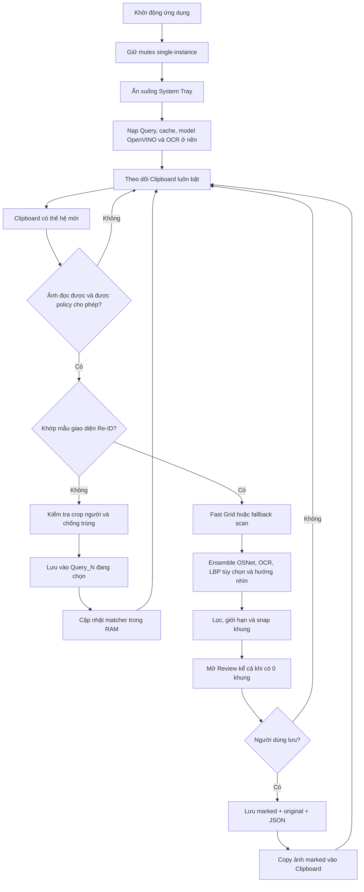

# Đặc tả tính năng và logic nghiệp vụ AutoMarker Re-ID

> Mục đích: dùng làm tài liệu đầu vào để xây dựng lại AutoMarker Re-ID trên một tech stack khác. Đặc tả tập trung vào hành vi người dùng, quy tắc nghiệp vụ, luồng dữ liệu và thuật toán; không phụ thuộc framework giao diện hay ngôn ngữ lập trình của ứng dụng cũ.

## 1. Tổng quan

AutoMarker Re-ID là ứng dụng desktop Windows chạy cục bộ, dùng để:

- Theo dõi ảnh mới trong Clipboard.
- Nhận biết ảnh chụp đúng giao diện tìm kiếm Re-ID.
- Tìm các thẻ kết quả cùng người bằng OpenCV, ensemble OSNet/OpenVINO và OCR thời gian; detector mặt chỉ ghi nhận hướng nhìn, không tham gia quyết định identity.
- Vẽ khung quanh các thẻ đã nhận diện.
- Cho người dùng duyệt, thêm/xóa khung, cắt/ghép ảnh, lưu kết quả và copy lại vào Clipboard.
- Thu thập crop người vào thư mục `Query_N` do người dùng chọn.

Ứng dụng không có web server, REST API, cơ sở dữ liệu hay dịch vụ cloud trong runtime. Dữ liệu chính được lưu bằng ảnh, cache NumPy và JSON sidecar trên máy.

Hệ thống mới có thể thay đổi cách tổ chức mã, giao diện và cơ chế đóng gói, nhưng cần bảo toàn các hành vi và invariant được ghi trong tài liệu này.

## 2. Sơ đồ luồng chính



## 3. Danh sách tính năng của ứng dụng

### 3.1. Khởi động, trạng thái và vòng đời ứng dụng

- Chỉ cho chạy một instance bằng Win32 named mutex. Chạy lần hai sẽ báo ứng dụng đang ở khay hệ thống rồi thoát.
- Khởi động ẩn dưới System Tray, tự nạp engine và tự bật theo dõi Clipboard; không có nút pause/resume.
- Nạp model, feature Query và warm-up OCR trên thread nền để không khóa giao diện.
- Chấm trạng thái chuyển từ đỏ sang xanh khi matcher đã sẵn sàng; lỗi khởi tạo giữ trạng thái lỗi.
- Đóng cửa sổ chính chỉ ẩn xuống tray. Thoát thật qua menu tray.
- Menu tray có: hiện ứng dụng, chụp vùng, chụp lại vùng cũ, chọn Query, bật/tắt LBP, khởi động lại và thoát.
- OSD topmost xuất hiện khoảng một giây khi đổi Query, đổi LBP hoặc có cảnh báo capture.

### 3.2. Cửa sổ chính

| Khu vực | Tính năng và hành vi |
| --- | --- |
| Header | Tên app, mô tả, chấm trạng thái theo dõi |
| Làm mới OCR | Làm mới danh sách Query, hỏi xác nhận rồi xóa/rebuild toàn bộ cache feature và OCR trên thread nền |
| Thư viện | Mở thư viện kết quả trong `output/` |
| Xóa log | Xóa cả log đang hiển thị và log còn chờ trong queue |
| Xóa toàn bộ dữ liệu | Xóa vĩnh viễn toàn bộ ảnh Query, cache AI và toàn bộ kết quả trong `output/` sau khi xác nhận |
| Chụp vùng | Mở overlay chọn một vùng mới |
| Chụp lại | Chụp lại vùng gần nhất mà không mở overlay |
| Lưu ảnh | Bật/tắt việc lưu ảnh chụp vùng vào thư mục Screenshots của Windows |
| Ảnh chụp | Mở thẳng Image Editor với ảnh chụp mới nhất hoặc ảnh đã chọn trước đó |
| Sửa ảnh | Chọn một file ảnh bất kỳ và mở Image Editor |
| Lưu vào | Chọn `Query_N` đích cho crop người mới; việc chọn sẽ tạo thư mục nếu chưa tồn tại |
| Query trống | Chọn slot Query chưa có ảnh; danh sách luôn có tối thiểu `Query_1` đến `Query_14` và mở rộng theo dữ liệu thực tế |
| Khớp trang phục | Bật/tắt LBP tie-break ngay trên matcher đang chạy; mặc định tắt |
| Phím tắt | Hiển thị trạng thái đăng ký thực tế, tổ hợp dự phòng và tổ hợp bị ứng dụng khác chiếm |
| Sidebar Query | Chọn Root hoặc một Query riêng, hiển thị số folder/số ảnh, sắp xếp tự nhiên (`Query_2` trước `Query_10`) |
| Activity Log | Nhận `stdout`, tự cuộn, cập nhật an toàn từ thread nền |

Hai lựa chọn sau độc lập nhau:

- Query ở sidebar quyết định **phạm vi người cần nhận diện**.
- Query ở mục **LƯU VÀO** quyết định **nơi lưu crop người mới**.

### 3.3. Theo dõi Clipboard

- Poll theo `GetClipboardSequenceNumber` mỗi `0,1` giây. Nếu API sequence không có, app mới dùng hash ảnh làm fallback.
- Token có cả sequence và MD5 ảnh thu nhỏ, nên chụp lại cùng một vùng với pixel giống hệt vẫn được xem là sự kiện mới.
- Đọc ảnh qua `PIL.ImageGrab`; fallback sang Win32 `CF_DIB` và `CF_HDROP`.
- Với file ảnh được copy như file, chỉ nhận file có thời gian sửa trong vòng 5 giây để tránh xử lý file cũ.
- ShareX có thể tăng sequence trước khi payload ảnh sẵn sàng. App giữ event ở trạng thái pending và retry tối đa khoảng 5 giây thay vì bỏ mất lần chụp đầu.
- Bỏ qua một lần thay đổi Clipboard do chính thao tác **Lưu & Copy** của app tạo ra.
- Bỏ qua ảnh copy/paste do Excel sở hữu hoặc khi Excel foreground; nếu chủ sở hữu là ShareX thì vẫn cho qua.
- Khi đang xử lý ảnh hoặc Review còn mở, monitor không nhận ảnh mới. Khi Review đóng, app đồng bộ lại token Clipboard trước khi tiếp tục.

### 3.4. Phân loại ảnh Clipboard

Sau khi đọc được ảnh, app chia thành hai nhánh:

1. **Ảnh giao diện Re-ID**
   - Phải là ảnh ngang, rộng ít nhất 600 px.
   - Phải khớp `ui_template.png` ở một trong các scale `0.8, 0.9, 1.0, 1.1, 1.2` với score tối thiểu `0.70`.
   - Nếu thiếu hoặc không đọc được `ui_template.png`, ảnh bị xem là không phải giao diện Re-ID.
   - Ảnh hợp lệ đi vào pipeline matching và luôn mở Review, kể cả khi không tìm được khung nào.

2. **Ảnh không phải giao diện Re-ID**
   - Bản production xem đây là ứng viên crop người để thu thập Query.
   - Crop phải cao ít nhất 100 px, rộng ít nhất 35 px, tỷ lệ cao/rộng từ `1.2` đến `5.5` và độ lệch chuẩn pixel tối thiểu `12`.
   - Ảnh ngang, ảnh quá nhỏ, ảnh phẳng hoặc ảnh đã có sẽ bị bỏ qua và ghi lý do vào log.
   - Crop hợp lệ được lưu vào đúng `Query_N` đang chọn; app **không tự quyết định người đó thuộc Query nào** trong luồng Clipboard hiện tại.

### 3.5. Chụp vùng trực tiếp

- Chụp toàn virtual desktop, hỗ trợ nhiều màn hình.
- Ẩn cửa sổ chính trước khi lấy ảnh để cửa sổ app không lọt vào screenshot.
- Overlay không viền, topmost, con trỏ crosshair; kéo ngược chiều vẫn được chuẩn hóa tọa độ.
- Click hoặc vùng nhỏ hơn 5 px theo một chiều bị từ chối.
- `Esc` hủy; watchdog tự giải phóng overlay sau 30 giây nếu selector bị treo.
- Lưu vùng cuối để dùng chức năng **Chụp lại**.
- Không cho mở capture mới khi đang chọn vùng, đang xử lý ảnh, Review còn mở hoặc engine chưa sẵn sàng.
- Ảnh chụp được copy vào Clipboard ở nền và được đánh dấu để monitor không xử lý lại chính bản copy này.
- Ảnh ngang nhưng không phải Re-ID mở Image Editor trước; ảnh Re-ID hoặc ảnh không ngang đi thẳng vào pipeline phân loại.
- Nếu bật **Lưu ảnh**, ảnh được lưu dạng `ReID_YYYYMMDD_HHMMSS_microseconds.png` vào thư mục Screenshots chuẩn và thư mục Pictures đã redirect nếu Windows trả về một đường dẫn khác.

### 3.6. Quản lý Query

- Tất cả Query nằm dưới `queries/Query_N/`.
- Chọn Root sẽ nhận diện trên toàn bộ Query; chọn một folder sẽ chỉ nhận diện người trong folder đó.
- Chuyển Query chỉ đổi view `reference_images`/`query_images` trong RAM, không compile lại OpenVINO hay đọc lại toàn bộ ảnh.
- Thu thập Query qua Clipboard luôn bật và không có công tắc tắt trong UI.
- Crop mới bắt buộc có Query đích hợp lệ từ `Query_1` đến `Query_999`.
- Chống trùng bằng ba lớp:
  - SHA-256 của pixel và shape cho ảnh giống tuyệt đối.
  - Perceptual hash.
  - Difference hash.
- Ảnh hợp lệ được đặt tên `capture_<timestamp>.png`, OCR thời gian ngay, thêm embedding vào matcher đang chạy và calibration lại Query liên quan mà không reload model.
- Nút **Query trống** tìm folder thiếu hoặc chưa có ảnh, thay vì chỉ tìm số folder chưa tồn tại.

### 3.7. Nhận diện Re-ID

- Dùng OpenVINO chạy hoàn toàn cục bộ.
- Ensemble body hiện có ba model OSNet-family:

| Model | Nguồn | Trọng số ensemble |
| --- | --- | ---: |
| `osnet_0288` | `reid.xml`/`reid.bin` đi kèm project | 0.25 |
| `osnet_lct_0277` | Project hoặc cache người dùng | 0.75 |
| `osnet_lct_0286` | Project hoặc cache người dùng | 1.00 |

- Không có TransReID trong biến thể hiện tại.
- Model thiếu hoặc lỗi được bỏ qua riêng lẻ; app tiếp tục bằng các model body còn hoạt động.
- Mỗi crop được resize theo input tĩnh của model, chuyển `float32` BGR, infer có lock riêng và L2-normalize embedding.
- Similarity là dot product/cosine của embedding đã normalize; ensemble là trung bình có trọng số.
- `face-detection-retail-0005` chỉ ghi chẩn đoán “thấy mặt” hoặc “quay lưng/nghiêng”; kết quả này không nhận diện người và không được phép nhận/loại body match.
- LBP trang phục là tín hiệu tie-break tùy chọn, không phải model nhận diện chính và không được trộn vào body score.

### 3.8. Review kết quả

- Review mở cả khi có `0` kết quả để người dùng có thể tự thêm khung.
- Hiển thị ảnh có khung và tự scale vừa cửa sổ.
- Click trái vào một thẻ để thêm hoặc xóa khung; click vào khoảng trống không tạo khung.
- Chuột phải trong Review thực hiện **Lưu & Copy**.
- Nút **CẮT / SỬA** mở Image Editor; sau khi sửa, app chạy matching lại để cập nhật tọa độ.
- `Esc` hoặc **HỦY** đóng mà không lưu.
- **LƯU & COPY** sẽ:
  1. Vẽ lại khung từ ảnh gốc và danh sách match hiện tại.
  2. Chọn folder output theo Query chiếm ưu thế.
  3. Lưu ảnh marked, ảnh original và JSON metadata.
  4. Copy ảnh marked vào Clipboard.
  5. Phát âm thanh thông báo và đóng Review.
- Review Tk hiện không có Undo/Redo cho thao tác thêm/xóa khung.

Nút **Ảnh chụp** mở thư viện riêng: danh sách ảnh trong `Pictures\Screenshots` nằm bên trái, ảnh mới nhất của phiên cũng được hiển thị, preview fit bên phải và có thể double-click hoặc bấm **Chỉnh sửa**. Ảnh sau chỉnh sửa được lưu thành file PNG mới để giữ ảnh gốc.

### 3.9. Thư viện kết quả

- Quét đệ quy toàn bộ `output/`, sắp xếp ảnh mới nhất trước.
- Không hiển thị các file `original_*` nội bộ.
- Có danh sách ảnh, canvas preview, Trước/Tiếp, Copy, Xóa, Làm mới và Đóng.
- Phím `←/→` chuyển ảnh, `Ctrl+C` copy, `Delete` xóa, `Esc` đóng.
- Với kết quả có JSON sidecar và ảnh original, click canvas để thêm/xóa khung. Thay đổi được ghi khi chuyển ảnh hoặc đóng thư viện.
- Ảnh legacy không có sidecar chỉ xem/copy, không sửa khung.
- Copy dùng phiên bản đang chỉnh sửa và đánh dấu để monitor bỏ qua lần ghi Clipboard đó.
- Xóa đưa ảnh marked, JSON và ảnh original liên quan vào Recycle Bin; hiện không có hộp xác nhận trước khi xóa.

### 3.10. Image Editor

- **Crop**: giữ lại vùng được kéo chọn.
- **Cut-out**:
  - Kéo theo chiều ngang nhiều hơn sẽ xóa một dải dọc.
  - Kéo theo chiều dọc nhiều hơn sẽ xóa một dải ngang.
- Thao tác cắt được áp dụng ngay khi thả chuột.
- Có Hoàn tác, Đặt lại, hiển thị kích thước và hướng dẫn thao tác.
- `Ctrl+Z` hoàn tác; editor hiện không có Redo.
- `Ctrl+S` hoặc `Enter` lưu; `Esc` hủy drag/selection hiện tại, sau đó mới đóng.
- Ảnh chỉ được thu nhỏ để vừa canvas, không tự phóng lớn quá 100%.
- Ghép ảnh trái/phải giữ nguyên pixel, căn giữa theo chiều dọc và tô phần thiếu bằng nền xám.
- Có thể chọn file ngoài qua nút **Ghép trái/phải**.
- Khi có thư mục thư viện:
  - Sidebar hiển thị thumbnail theo thứ tự mới nhất.
  - Click thumbnail để chuyển ảnh.
  - Kéo quá 8 px tạo ghost image; thả vào canvas để đưa ảnh vào trạng thái chờ ghép.
  - Chọn **Ghép trái**, **Ghép phải** hoặc **Bỏ** trên thanh ảnh chờ.
  - Khi chuyển thumbnail mà ảnh hiện tại chưa lưu, app hỏi Lưu/Bỏ/Ở lại.
- Đóng hoặc Hủy editor trực tiếp không hỏi xác nhận thay đổi chưa lưu; hộp xác nhận chỉ có ở luồng chuyển thumbnail.

### 3.11. Cache, làm mới và xóa dữ liệu

- Mỗi Query có thư mục `.cache` chứa feature và OCR theo đúng tên ảnh nguồn.
- Cache chỉ được dùng nếu `mtime(cache) >= mtime(ảnh)`; cache hỏng, cũ hoặc thiếu sẽ được tính lại.
- App dọn cache mồ côi khi ảnh nguồn đã bị xóa hoặc chuyển đi.
- **Làm mới OCR** xóa tất cả `.cache`, sau đó trích xuất feature và OCR lại từ đầu trên thread nền. Ảnh Query không bị xóa.
- **Xóa toàn bộ dữ liệu** xóa vĩnh viễn ảnh ở mọi Query, toàn bộ cache và toàn bộ `output/` sau khi xác nhận.

### 3.12. Chế độ CLI độc lập

Ngoài GUI, ứng dụng cũ có một chế độ dòng lệnh. Nếu bản viết lại cần giữ tương thích chức năng này, CLI cần hỗ trợ:

- Theo dõi Clipboard bằng vòng lặp console.
- Xử lý một ảnh bằng tham số `--single <đường dẫn>`.
- Chỉ dùng một Query bằng `--query Query_N`.
- Đổi thư mục Query/output, threshold và bật cửa sổ debug.

CLI dùng cùng matching engine và pipeline lưu ảnh, nhưng không có Review tương tác như GUI.

## 4. Logic matching chi tiết

### 4.1. Nạp reference và calibration

Khi engine khởi tạo:

1. Quét các folder trong `queries/` theo thứ tự tự nhiên.
2. Với mỗi ảnh, thử đọc `.cache/<tên ảnh>.npz` và `.cache/<tên ảnh>.ocr.txt`.
3. Nếu feature cache không hợp lệ, trích xuất embedding của tất cả model đang dùng rồi ghi `.npz`.
4. Nếu OCR cache không hợp lệ, đọc timestamp ở phần đáy thẻ rồi ghi `.ocr.txt` khi nhận được kết quả.
5. Tạo descriptor LBP trong RAM; LBP rẻ nên hiện không ghi ra file.
6. Calibration threshold riêng cho từng Query:
   - Lấy percentile 10 của các score nội bộ giữa các reference.
   - Trừ tolerance `0.05`.
   - Clamp vào khoảng `0.65..0.90`.
   - Nếu không đủ cặp reference, dùng ngưỡng chung `0.68`.

Hiện `QUERY_IMAGE_PREFIXES = ()`, vì vậy tất cả ảnh hợp lệ trong `Query_N` đều được nạp làm reference; không có tên file nào tự động bị coi là “source/query image” để loại khỏi reference.

### 4.2. Fast Grid

Fast Grid là đường tăng tốc mặc định khi nhận ra bố cục lưới:

1. Tìm tối đa hai dải hàng có đủ pixel ảnh.
2. Dò biên thẻ theo projection cột sáng, xây model chiều rộng và khoảng cách lặp lại. Cần tối thiểu bốn segment thẻ dọc để xác nhận lưới.
3. Khi một header card quá tối nhưng nhịp lưới đủ tin cậy, chiếu lại cột còn thiếu theo width/pitch của hàng chuẩn.
4. Xem thẻ đầu tiên là source/query card và bỏ khỏi danh sách kết quả.
5. OCR từng thẻ: timestamp đọc được chỉ so với bucket tương ứng; OCR không đọc được dùng toàn bộ reference.
6. Chạy toàn bộ body ensemble và chính sách open-set trên từng candidate.
7. Detector mặt chỉ ghi hướng “thấy mặt” hoặc “quay lưng/nghiêng”, không thay đổi quyết định.
8. Nếu không xác nhận được lưới đều, chuyển sang contour fallback.

### 4.3. Full/fallback scan

- Khi không nhận ra lưới, app dùng Canny + morphology + contour để tìm card dọc.
- Bỏ candidate nằm trong 25% panel trái, áp NMS với IoU `0.30` và giới hạn tối đa 150 candidate.
- Contour rộng bất thường bị loại; vị trí đầu hàng bị dính contour có thể được khôi phục theo median width/pitch.
- Lỗi ở một candidate chỉ làm candidate đó bị bỏ và được ghi vào chẩn đoán, không làm dừng cả ảnh.

### 4.4. Chính sách open-set của body Re-ID

Với mỗi candidate:

1. Trích xuất embedding từ các model body còn hoạt động.
2. So với tất cả reference trong từng identity.
3. Score của identity là trung bình của tối đa hai reference tốt nhất.
4. Giữ thêm score của reference tốt nhất và winner của từng model.
5. Chấp nhận body match khi đồng thời thỏa:
   - `identity_score >= threshold` đã calibration của Query.
   - `top1 - top2 >= 0.06`.
   - `best_reference_score >= 0.62`, trừ trường hợp timestamp chính xác xác nhận reference.
   - Khi có từ hai model, không model nào chọn identity khác winner ensemble.
6. Face không được dùng để cứu hoặc loại identity; nó chỉ ghi hướng nhìn sau khi body match đã đạt.

Nhánh “body gần ngưỡng + exact timestamp rescue” có code và test, nhưng các call runtime hiện đều truyền `allow_time_rescue=False`; do đó nhánh rescue này chưa chạy trong ứng dụng.

### 4.5. LBP trang phục

LBP mặc định tắt và chỉ được dùng để phá tie top-1/top-2, không phải để nhận một người mới từ đầu.

- Chuẩn hóa crop về `64 × 128`.
- Tạo hai histogram LBP 256-bin cho thân trên và thân dưới; descriptor tổng cộng 512 phần tử.
- Bỏ crop quá nhỏ, quá ngang hoặc quá phẳng.
- Similarity dùng `1 - Bhattacharyya distance`.
- Chỉ rescue khi:
  - Body đã qua ngưỡng tuyệt đối.
  - Best reference đã qua `0.62`.
  - Các model body đồng ý winner.
  - LBP cũng chọn đúng winner đó.
  - LBP score `>= 0.75` và cách hạng nhì `>= 0.02`.
- LBP không thay đổi body score, chỉ thêm bằng chứng để chấp nhận một tie an toàn.
- Face không có quyền ưu tiên hơn body hoặc LBP.

### 4.6. OCR timestamp

- RapidOCR chạy bằng OpenVINO và được warm-up khi app khởi tạo.
- Với thẻ nhỏ, OCR cắt lần lượt 18%, 20%, 22%, 25%, 28%, 30% phần đáy, phóng 8 lần và chạy recognition-only.
- Dừng sớm khi hai crop độc lập đọc cùng một timestamp.
- Nếu không có vote, mới chạy full detection/classification trên vùng đáy; sau đó fallback Windows OCR.
- Thời gian được chuẩn hóa về dạng như `7:42 AM`.
- `OCR_TIMESTAMP_TOLERANCE = 0`: timestamp đọc được phải khớp chính xác đến phút.
- Trước AI:
  - Nếu timestamp thẻ đọc được, chỉ so với reference cùng timestamp.
  - Nếu không tồn tại bucket timestamp phù hợp, loại candidate ngay.
  - Nếu OCR không đọc được, giữ toàn bộ phạm vi reference và để AI quyết định.
- Sau AI:
  - Timestamp thẻ phải khớp timestamp của đúng reference thắng về thị giác.
  - Timestamp cũng phải tồn tại trong tập timestamp của Query.
  - Mỗi timestamp có quota bằng số reference trong bucket đó; source chỉ trừ một slot khi dùng cùng timestamp.
  - Card OCR không đọc được vẫn được giữ nếu AI đạt, sau đó chịu giới hạn tổng `reference_count - 1`.
- OCR toàn screenshot và early folder filtering hiện đang bị comment tắt để tiết kiệm thời gian; logic thực tế dùng OCR theo từng card.

### 4.7. Hậu xử lý và vẽ khung

Sau khi phân loại:

1. Nếu có nhiều Query, chỉ giữ Query có nhiều box nhất; hòa số lượng thì Query có tổng score lớn hơn thắng.
2. Giữ tối đa hai hàng kết quả đang hiển thị.
3. Xóa match overlap source card với IoU lớn hơn `0.30`.
4. Loại contour rộng quá `1.5×` median card của hàng; nếu contour rộng che vị trí card đầu hàng thì khôi phục card theo median nhịp lưới.
5. Với kết quả tự động, giới hạn số box bằng `số reference - 1`; thao tác thêm/xóa thủ công trong Review/Library không bị giới hạn này.
6. Căn thẳng trục dọc các box cùng hàng theo median.
7. Snap box theo biên ngoài của toàn bộ thẻ, giữ cả phần viền/nền xám và không inset vào vùng ảnh camera.
8. Tách các box liền nhau tối thiểu 4 px để border không chồng lên nhau.
9. Vẽ border dày 2 px. Màu đầu tiên là đỏ; palette hỗ trợ nhiều Query dù rule hiện chỉ giữ một Query chiếm ưu thế.

Click thêm/xóa khung trong Review và Thư viện dùng cùng logic snap này, vì vậy khung chỉnh tay vẫn bám theo card.
Click thủ công được phép thêm cả source card và không bị giới hạn số lượng khung tự động.

## 5. Lưu trữ và metadata

### 5.1. Cấu trúc dữ liệu

```text
queries/
├── Query_1/
│   ├── capture_YYYYMMDD_HHMMSS_microseconds.png
│   ├── <các ảnh reference khác>
│   └── .cache/
│       ├── <tên ảnh>.npz
│       └── <tên ảnh>.ocr.txt
└── Query_2/
    └── ...

output/
└── Query_1/
    ├── marked_YYYYMMDD_HHMMSS_microseconds.png
    ├── original_YYYYMMDD_HHMMSS_microseconds.png
    └── marked_YYYYMMDD_HHMMSS_microseconds.json

%LOCALAPPDATA%/ReIDAutoOSNet/models/
├── reid_0277.xml / .bin
├── reid_0286.xml / .bin
├── face-detection-retail-0005.xml / .bin
└── face-reidentification-retail-0095.xml / .bin  # legacy, runtime không nạp
```

Trong bản portable, `queries/` và `output/` nằm cạnh EXE để có thể ghi và mang theo; tài nguyên đóng gói nằm trong thư mục runtime `_internal`/`_MEIPASS`.

### 5.2. JSON sidecar

JSON kết quả chứa:

- Danh sách `matches` đã chuyển sang kiểu JSON-safe.
- `bbox`, Query, score, reference thắng, model score, timestamp và các cờ rescue nếu có.
- Tên ảnh marked và original.
- Timestamp dùng để đặt tên bộ file.

JSON được ghi vào file `.tmp`, `flush` + `fsync`, rồi `os.replace` để cập nhật atomic. Khi load metadata, app kiểm tra đường dẫn ảnh original vẫn nằm trong đúng thư mục output để tránh path traversal.

## 6. Phím tắt và thao tác chuột

### 6.1. Phím tắt toàn cục của ứng dụng

| Phím/thao tác | Chức năng | Ghi chú |
| --- | --- | --- |
| `F4` | Query trước | Có quay vòng |
| `F5` | Query tiếp theo | Có quay vòng |
| `F3` | Chọn Root/Tất cả |  |
| `F2` | Chọn Query trống | Chỉ thực thi khi foreground là Blaze hoặc Excel |
| `Alt+PrintScreen` | Chọn vùng chụp mới | Nếu bị chiếm, thử `Ctrl+Alt+PrintScreen`, sau đó `Ctrl+Alt+Shift+R` |
| `Alt+S` | Chụp lại vùng gần nhất |  |
| `Ctrl+Alt+Shift+F10` | Trigger capture từ tích hợp Blaze/AHK | Dự phòng cho mouse hook |
| Chuột phải trong Blaze | Mở chụp vùng | Không nuốt click khi con trỏ ở taskbar/tray |
| Chuột giữa trong Blaze/Excel | Chuyển foreground giữa Blaze và Excel | Dùng cached HWND và Win32 foreground switch |

Nếu Windows từ chối một hotkey, dialog **Phím tắt** ghi rõ tổ hợp nào hoạt động và tổ hợp nào thất bại. Hành động chụp vùng có chuỗi fallback tự động khi `Alt+PrintScreen` bị ứng dụng khác chiếm.

### 6.2. Phím tắt theo cửa sổ

| Cửa sổ | Phím/thao tác |
| --- | --- |
| Review | `Esc` hủy; click trái thêm/xóa khung; chuột phải Lưu & Copy |
| Thư viện | `←/→` chuyển ảnh; `Ctrl+C` copy; `Delete` xóa; `Esc` đóng |
| Image Editor | `Ctrl+Z` hoàn tác; `Ctrl+S`/`Enter` lưu; `Esc` hủy selection/đóng |

## 7. Kiến trúc logic đề xuất cho bản viết lại

Tên component dưới đây chỉ mô tả trách nhiệm; đội phát triển có thể ánh xạ chúng thành service, class, module, process hoặc actor phù hợp với tech stack mới.

| Component logic | Trách nhiệm chính |
| --- | --- |
| Application Controller | Quản lý vòng đời, state toàn cục, điều phối capture/Clipboard/matching/Review |
| Clipboard Monitor | Phát hiện generation mới, retry payload đến chậm, chặn own-copy và áp dụng policy Excel/ShareX |
| Screen Capture Service | Chụp virtual desktop, chọn vùng, lưu và chụp lại vùng gần nhất |
| Re-ID Interface Detector | Gate ảnh đầu vào bằng hình dạng và template giao diện |
| Query Repository | CRUD Query, sắp xếp tự nhiên, đếm ảnh, chọn phạm vi nhận diện và Query đích |
| Query Collector | Validate crop người, chống trùng, lưu reference mới và cập nhật index đang chạy |
| Feature Cache | Đọc/ghi embedding và OCR cache, kiểm tra phiên bản/mtime, dọn cache mồ côi |
| Model Runtime | Nạp và chạy body ensemble; detector mặt chỉ phân loại hướng nhìn, quản lý thread safety |
| OCR Service | Đọc timestamp thẻ, chuẩn hóa, consensus, fallback và so khớp thời gian |
| Candidate Generator | Fast Grid, khôi phục cột tối, contour fallback, vùng bỏ qua, NMS và cap candidate |
| Identity Classifier | Tính identity score, margin, model agreement, LBP rescue và open-set rejection |
| Match Post-processor | Single-query rule, source removal, giữ hai hàng, quota timestamp, căn hàng và tách box liền nhau |
| Box Geometry Service | Snap thẻ, thêm/xóa box theo click và vẽ border |
| Review Controller | Quản lý bản nháp match, chỉnh tay, lưu/hủy và chặn monitor trong lúc review |
| Result Repository | Lưu marked/original/metadata, load/update an toàn và liệt kê thư viện |
| Image Editor | Crop, cut-out, undo/reset, ghép ảnh và quản lý thay đổi chưa lưu |
| Hotkey/Tray/OSD Service | Đăng ký lệnh toàn cục, fallback hotkey, menu nền và phản hồi nhanh |

## 8. Các giá trị cấu hình quan trọng hiện tại

| Cấu hình | Giá trị | Ý nghĩa |
| --- | ---: | --- |
| `POLL_INTERVAL` | `0.1 s` | Chu kỳ poll Clipboard |
| `CLIPBOARD_IMAGE_READY_TIMEOUT_SECONDS` | `5.0 s` | Cửa sổ retry payload ShareX |
| `REID_INTERFACE_MATCH_THRESHOLD` | `0.70` | Gate nhận diện giao diện bằng `ui_template.png` |
| `AI_MATCH_THRESHOLD` | `0.68` | Body threshold chung khi chưa calibration |
| `AI_MATCH_MARGIN` | `0.06` | Khoảng cách tối thiểu top-1/top-2 |
| `AI_BEST_REFERENCE_THRESHOLD` | `0.62` | Bằng chứng tối thiểu từ một reference mạnh |
| `AI_TOP_K_REFERENCES` | `2` | Số reference tốt nhất để tính identity score |
| `FACE_DETECTION_THRESHOLD` | `0.75` | Ngưỡng detect mặt |
| `OCR_TIMESTAMP_TOLERANCE` | `0 phút` | So chính xác HH:MM |
| `FAST_ROOT_MAX_ROWS` | `2` | Số hàng lưới tối đa |
| `MAX_PIXEL_CANDIDATES` | `150` | Cap candidate fallback |
| `IGNORE_LEFT_RATIO` | `0.25` | Bỏ panel trái |
| `IGNORE_BOTTOM_RATIO` | `0.35` | Bỏ phần đáy ảnh |
| `ENFORCE_SINGLE_QUERY` | `True` | Chỉ giữ một identity chiếm ưu thế |
| `LIMIT_MATCHES_BY_REFERENCE_COUNT` | `True` | Cap box bằng số reference trừ một |
| `ENABLE_APPEARANCE_MATCHING` | `False` | LBP mặc định tắt |
| `APPEARANCE_SIMILARITY_FLOOR` | `0.75` | Sàn LBP tie-break |
| `APPEARANCE_RESCUE_MARGIN` | `0.02` | Margin LBP tối thiểu |
| `BOX_THICKNESS` | `2 px` | Độ dày khung |

Các ngưỡng AI/OCR là giá trị đã hiệu chỉnh cho bộ OSNet hiện tại và dữ liệu thực tế của project; cần đo lại nếu thay model, cách crop hoặc bộ reference.

## 9. Phạm vi tương thích bắt buộc khi viết lại

Các hành vi sau là logic của ứng dụng hiện tại và cần được giữ nguyên nếu mục tiêu là tương thích:

1. Thu thập Clipboard **luôn lưu vào Query do người dùng chọn**, không tự phân người sang Query khác.
2. Không có tính năng Batch trong luồng chính.
3. Identity chỉ dùng ensemble OSNet-family và LBP tùy chọn; Face chỉ ghi hướng nhìn, không phụ thuộc TransReID.
4. Khung được snap theo biên ngoài của card, không inset vào vùng ảnh camera.
5. OCR toàn screenshot không tham gia quyết định; OCR theo từng card mới là gate thực tế.
6. Near-threshold timestamp rescue chưa được bật trong luồng runtime.
7. Mọi ảnh hợp lệ trong một folder Query đều là reference; không có quy ước tên file để tự loại ảnh source.
8. Kết quả tự động cap theo `reference_count - 1`; khung thêm thủ công không bị cap.
9. Chỉ giữ một Query chiếm ưu thế trên mỗi screenshot.
10. Review phải mở kể cả khi matcher trả về 0 khung.
11. Nút **Xóa toàn bộ dữ liệu** xóa vĩnh viễn cả Query, cache và output sau xác nhận.
12. Xóa trong Thư viện phải là thao tác có thể khôi phục tương đương Recycle Bin.

Những khả năng có trong mã hỗ trợ nhưng không thuộc yêu cầu tương thích của app hiện tại:

- Tự detect nhiều thumbnail rồi tự phân nhóm/tạo Query mới.
- Batch processing và folder `Chua_xac_dinh`.
- OCR toàn screenshot để lọc folder sớm.
- Near-threshold body match được cứu bằng exact timestamp.

## 10. State machine của ứng dụng

### 10.1. Trạng thái toàn cục

| State | Ý nghĩa | Sự kiện chuyển tiếp |
| --- | --- | --- |
| `STARTING` | Đang nạp Query, model và OCR | Thành công → `MONITORING`; lỗi → `ERROR` |
| `MONITORING` | Đang chờ Clipboard/capture | Có ảnh hợp lệ → `PROCESSING`; chọn vùng → `CAPTURING` |
| `CAPTURING` | Overlay đang chọn vùng | Có crop → `PROCESSING`; hủy → `MONITORING` |
| `PROCESSING` | Đang phân loại hoặc matching | Crop Query xong → `MONITORING`; screenshot xong → `REVIEWING`; lỗi → `MONITORING` |
| `REVIEWING` | Người dùng đang duyệt/chỉnh match | Lưu hoặc hủy → `MONITORING` |
| `REBUILDING_CACHE` | Đang tạo lại feature/OCR | Thành công/lỗi → `MONITORING` |
| `ERROR` | Engine không khởi tạo được | Restart/retry theo quyết định của UI |
| `SHUTTING_DOWN` | Đang gỡ hotkey, tray và tài nguyên | Kết thúc process |

### 10.2. Invariant về concurrency

- Tại một thời điểm chỉ có một ảnh được xử lý.
- Không poll ảnh mới khi đang `PROCESSING` hoặc `REVIEWING`.
- Không mở hai overlay capture đồng thời.
- Inference request dùng chung phải được serialize hoặc dùng pool instance thread-safe.
- OCR engine dùng chung phải thread-safe; nếu không, phải khóa quanh inference.
- Mọi cập nhật UI từ worker phải được marshal về UI thread.
- Đóng Review phải đồng bộ generation Clipboard trước khi mở lại monitor.

## 11. Data contract đề xuất

### 11.1. Query

```text
Query {
  id: string,                 // ví dụ Query_1
  references: Reference[],
  calibratedThreshold: float
}

Reference {
  id: string,
  imagePath: string,
  embeddings: map<ModelName, float[]>,
  timestamp: string | null,
  appearanceDescriptor: float[] | null
}
```

### 11.2. Match

```text
Match {
  queryId: string,
  referenceId: string | null,
  bbox: { x1: int, y1: int, x2: int, y2: int },
  score: float,
  margin: float | null,
  bestReferenceScore: float | null,
  pixelScore: float | null,
  modelScores: map<ModelName, float>,
  cardTimestamp: string | null,
  source: "body" | "body+appearance" | "manual" (`face` chỉ còn để tương thích metadata cũ),
  manuallyEdited: bool
}
```

### 11.3. Kết quả lưu

```text
SavedResult {
  id: string,
  createdAt: datetime,
  dominantQueryId: string | null,
  originalImagePath: string,
  markedImagePath: string,
  matches: Match[]
}
```

Metadata phải được ghi atomic. Nếu không ghi đủ ảnh original, ảnh marked và metadata thì transaction lưu được xem là thất bại và không để lại bộ file nửa chừng.

## 12. Xử lý lỗi và fallback bắt buộc

| Tình huống | Hành vi yêu cầu |
| --- | --- |
| Clipboard generation đổi nhưng ảnh chưa đọc được | Giữ pending và retry trong khoảng 5 giây |
| Clipboard do app tự ghi | Bỏ qua đúng một generation |
| Clipboard từ Excel | Bỏ qua, trừ khi producer là ShareX |
| Ảnh không phải giao diện Re-ID | Thử validate như crop Query; nếu không đạt thì log và bỏ qua |
| Thiếu template nhận diện UI | Không cho ảnh đi vào matcher |
| Một model tùy chọn thiếu/lỗi | Bỏ model đó, tiếp tục với model còn lại |
| Không còn body model nào | Báo engine không khả dụng; không tạo match giả |
| RapidOCR lỗi | Disable backend lỗi và fallback OCR còn lại |
| OCR không đọc được timestamp | Không reject chỉ vì thiếu OCR; để AI quyết định |
| Fast Grid không xác định được hoặc trả rỗng | Chạy fallback scan đầy đủ |
| Một candidate inference lỗi | Bỏ candidate đó, tiếp tục các candidate khác |
| Không tìm thấy match | Vẫn mở Review với danh sách rỗng |
| Lưu kết quả lỗi giữa chừng | Rollback file vừa tạo và báo lỗi |
| Capture bị treo | Watchdog hủy overlay và trả app về trạng thái theo dõi |

## 13. Tiêu chí nghiệm thu cho bản viết lại

### 13.1. Clipboard và capture

- Nhận được hai lần chụp liên tiếp dù pixel giống hệt nhau.
- Không mất ảnh ShareX khi sequence xuất hiện trước payload.
- Không mở Review lặp lại sau **Lưu & Copy**.
- Không xử lý nhầm ảnh Excel; vẫn nhận ảnh ShareX khi Excel foreground.
- Capture hoạt động trên virtual desktop nhiều màn hình và chụp lại đúng vùng cũ.

### 13.2. Query

- `Query_2` được sắp trước `Query_10`.
- Chuyển Query không reload/compile lại model.
- Crop không đúng dáng người hoặc crop trùng không được lưu.
- Reference mới dùng được ngay mà không cần restart.

### 13.3. Matching

- Fast Grid rỗng phải tự fallback thay vì trả kết luận âm tính.
- Body match chỉ được nhận khi qua threshold, margin, best-reference và model-agreement gate.
- Timestamp đọc được nhưng sai reference phải loại candidate.
- Timestamp không đọc được không tự động làm candidate thất bại.
- Chỉ một Query chiếm ưu thế được giữ lại.
- Giữ tối đa hai hàng kết quả; chỉ kết quả tự động bị cap theo `reference_count - 1`, khung thủ công được thêm tự do.
- Source card không được vẽ khung.

### 13.4. Review và persistence

- Review mở với cả 0 match.
- Click vào card thêm/xóa đúng một box; click khoảng trống không thay đổi dữ liệu.
- Lưu tạo đủ original, marked và metadata nhất quán.
- Thư viện có thể load lại metadata, chỉnh box và lưu lại mà không mất ảnh original.
- Copy kết quả không kích hoạt lại pipeline.

### 13.5. Hiệu năng và độ ổn định

- Khởi tạo model/cache không khóa UI thread.
- UI vẫn phản hồi trong lúc matching và rebuild cache.
- Không có hai job matching chạy đồng thời trên cùng state người dùng.
- Lỗi một model, OCR backend hoặc candidate không làm crash toàn ứng dụng.
